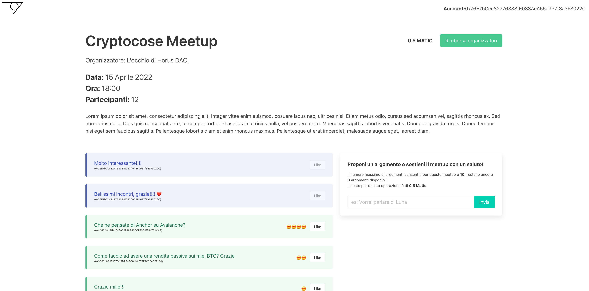

# Meetup Dapp (WIP)

A simple frontend React application to interact with this [Smart Contract](https://github.com/robertcasanova/meetup-smart-contract)

*This is just a PoC, the code is not tested yet and lot of things must be improved*

## Install deps

`npm i`

## Setup

Rename `.env.local.sample` to `.env.local` and set the `REACT_APP_MEETUP_CONTRACT_ADDRESS` address to the smart contract address of Meetup (es: [0xc68EafAf44bF73cc7469E1aFC0e3a4a687a55961](https://mumbai.polygonscan.com/address/0xc68EafAf44bF73cc7469E1aFC0e3a4a687a55961)).

## Run

`npm run start`

### Screenshot

